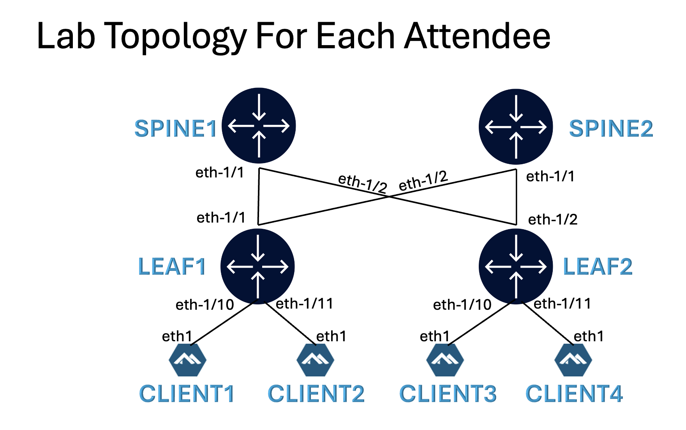
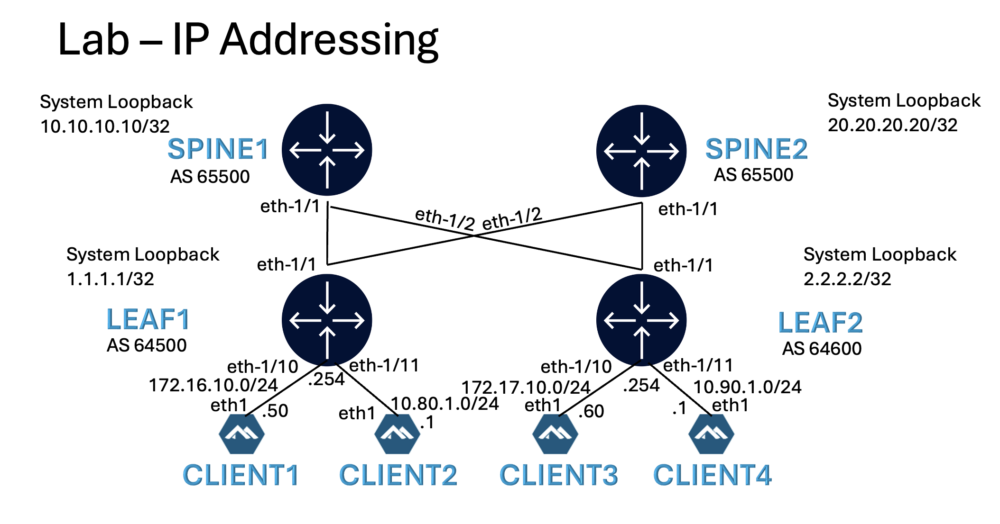

# Welcome to the BGP for DC Workshop at NANOG 95

This README is your starting point into the hands on section.

Please contact [**Reda Laichi**](https://www.linkedin.com/in/reda-l-5b28292) or [**Saju Salahudeen**](https://www.linkedin.com/in/saju-salahudeen) if you have any questions.

Pre-requisite: A laptop with SSH client

Shortcut links to major sections in this README:

|   |   |
|---|---|
| [Lab Topology](#lab-topology) | [Deploying the lab](#deploying-the-lab) |
| [IPv4 Addressing](#ipv4-link-addressing) | [CLI Quick Reference](#sr-linux-configuration-mode) |
| [BGP Peering](#configure-bgp-peering) | [Enabling BFD](#enabling-bfd-on-leaf-spine-links) |
| [Route Policies](#configuring-route-policies) | [ECMP](#enabling-ecmp) |
| [AS Path](#bgp-attribute---as-path) | [IP Fabric](#ip-fabric-with-no-overlay) |
| [Community](#bgp-attribute---community) | [Local Preference](#bgp-attribute---local-preference) |
| [EVPN Overlay](#evpn-overlay) | [Debugging](#bgp-debugging)

## Lab Environment

A Nokia team member will provide you with a card that contains:
- your VM hostname
- SSH credentials to the VM instance
- URL of this repo

> <p style="color:red">!!! Make sure to backup any code, config, ... <u> offline (e.g on your laptop)</u>. 
> The VM instances will be destroyed once the Workshop is concluded.</p>

---
<div align=center>
<a href="https://codespaces.new/srlinuxamericas/n95-bgp?quickstart=1">
</a>

**[Run](https://codespaces.new/srlinuxamericas/n95-bgp?quickstart=1) this lab in GitHub Codespaces for free**.  
[Learn more](https://containerlab.dev/manual/codespaces/) about Containerlab for Codespaces.

</div>

---

## Workshop
The objective of the hands on section of this workshop is the following:
- Configure BGP peering
- Configure Route Policies
- Configure BGP attributes
- Configure IP fabric using underlay
- Configure EVPN overlay

## Lab Topology

Each workshop participant will be provided with the below topology consisting of 2 leaf and 2 spine nodes along with 4 clients.



## NOS (Network Operating System)

All leafs and Spines will be running the latest Nokia [SR Linux](https://www.nokia.com/networks/ip-networks/service-router-linux-NOS/) release 25.7.2.

All 4 clients will be running [goBGP](https://github.com/osrg/gobgp)

## Deploying the lab

Install Containerlab on your VM.

```bash
curl -sL https://containerlab.dev/setup | sudo -E bash -s "all"
```

Logout and login for the sudo privileges to take effect.

Use the below command to clone this repo to your VM.

```bash
sudo git clone https://github.com/srlinuxamericas/n95-bgp.git
```

Verify that the git repo files are available on your VM.

```bash
ls -lrt n95-bgp
```

Expected output on VM:

```bash
$ ls -lrt n95-bgp
total 608
-rw-r--r--  1 sabdulra sabdulra 105232 Oct 23 16:15 README.md
drwxr-xr-x  1 sabdulra sabdulra    302 Oct 23 16:15 configs
-rw-r--r--  1 sabdulra sabdulra 291379 Oct 23 16:15 ipv4-address.png
-rw-r--r--  1 sabdulra sabdulra   2495 Oct 23 16:15 srl-bgp.clab.yml
-rw-r--r--  1 sabdulra sabdulra 216409 Oct 23 16:15 lab-topology.png
```

To deploy the lab, run the following:

```bash
cd n95-bgp
sudo clab deploy -t srl-bgp.clab.yml
```

[Containerlab](https://containerlab.dev/) will deploy the lab and display a table with the list of nodes and their IPs.

```bash
22:53:50 INFO Adding host entries path=/etc/hosts
22:53:50 INFO Adding SSH config for nodes path=/etc/ssh/ssh_config.d/clab-bgp.conf
╭─────────┬──────────────────────────────┬─────────┬────────────────────╮
│   Name  │          Kind/Image          │  State  │   IPv4/6 Address   │
├─────────┼──────────────────────────────┼─────────┼────────────────────┤
│ client1 │ linux                        │ running │ 172.20.30.10       │
│         │ osrg/gobgp                   │         │ 2001:172:20:30::10 │
├─────────┼──────────────────────────────┼─────────┼────────────────────┤
│ client2 │ linux                        │ running │ 172.20.30.11       │
│         │ osrg/gobgp                   │         │ 2001:172:20:30::11 │
├─────────┼──────────────────────────────┼─────────┼────────────────────┤
│ client3 │ linux                        │ running │ 172.20.30.12       │
│         │ osrg/gobgp                   │         │ 2001:172:20:30::12 │
├─────────┼──────────────────────────────┼─────────┼────────────────────┤
│ client4 │ linux                        │ running │ 172.20.30.13       │
│         │ osrg/gobgp                   │         │ 2001:172:20:30::13 │
├─────────┼──────────────────────────────┼─────────┼────────────────────┤
│ leaf1   │ nokia_srlinux                │ running │ 172.20.30.5        │
│         │ ghcr.io/nokia/srlinux:25.7.1 │         │ 2001:172:20:30::5  │
├─────────┼──────────────────────────────┼─────────┼────────────────────┤
│ leaf2   │ nokia_srlinux                │ running │ 172.20.30.2        │
│         │ ghcr.io/nokia/srlinux:25.7.1 │         │ 2001:172:20:30::2  │
├─────────┼──────────────────────────────┼─────────┼────────────────────┤
│ spine1  │ nokia_srlinux                │ running │ 172.20.30.3        │
│         │ ghcr.io/nokia/srlinux:25.7.1 │         │ 2001:172:20:30::3  │
├─────────┼──────────────────────────────┼─────────┼────────────────────┤
│ spine2  │ nokia_srlinux                │ running │ 172.20.30.4        │
│         │ ghcr.io/nokia/srlinux:25.7.1 │         │ 2001:172:20:30::4  │
╰─────────┴──────────────────────────────┴─────────┴────────────────────╯
```

To display all deployed labs on your VM at any time, use:

```bash
sudo clab inspect --all
```

## Connecting to the devices

Find the nodename or IP address of the device from the above output and then use SSH.

Username: `admin`

Password: Refer to the provided card

```bash
ssh admin@leaf1
```

To login to the client, identify the client hostname using the `sudo clab inspect --all` command above and then:

```bash
sudo docker exec –it client3 sh
```

## Physical link connectivity

When the lab is deployed with the default startup config, all the links between leafs and clients are configured by containerlab.

This allows to start configuring bgp right away.

Here's a summary of what is included in the startup config:

- Configure interface between Leaf & Client
- Configure system loopback
- Configure default Network Instance (VRF) and add system loopback and Leaf/Client interfaces to this VRF
- Configure IPs and static routes on Clients

Check the [startup config](n95-bgp/configs/fabric/startup) files to see how these objects are configured in SR Linux.

To view Interface status on SR Linux use:

```srl
show interface
```

### IPv4 Link Addressing



### Verify reachability between leaf and client

After the lab is deployed, check reachability between leaf and client devices using ping.

Example on Leaf1 to Client1:

```srl
ping -c 3 172.16.10.50 network-instance default
```

## SR Linux Configuration Mode

To enter candidate configuration edit mode in SR Linux, use:

```srl
enter candidate private
```

To commit the configuration in SR Linux, use:

```srl
commit stay
```

Here's a reference table with some commonly used commands.

| Action | Command |
| --- | --- |
| Enter Candidate mode | `enter candidate {private}` |
| Commit configuration changes | `commit {now\|stay}` |
| | `now` – commits and exits from candidate mode |
| | `stay` – commits and stays in candidate mode |
| Delete configuration elements | `delete` |
| | Eg: `delete interface ethernet-1/5` |
| Discard configuration changes | `discard {now\|stay}` |
| Compare candidate to running | `diff running /` |
| View configuration in current mode & context | `info {flat}` |
| View configuration in another mode & context | `info {flat} from state /interface ethernet-1/1` |
| Output modifiers | `<command> \| as {table\|json\|yaml}` |
| Access Linux shell | `bash` |
| Find a command | `tree flat detail \| grep <keyword>` |

### Command alias

To save some typing, we added an alias `cs` for `commit stay` in the startup configs.

The next time you want to do a commit, just type in `cs`.

If you would like to create more aliases, use the below commands. Replace the `<alias>` with the alias you want to use and `<command>` with the actual command.

```srl
environment alias <alias> <command>
environment save home
```

## 1 Configure BGP peering

We are now ready to start configuring BGP.

The first step is to establish BGP peering sessions between the devices.

### Autonomous System (AS) number

For our lab topology:
- leaf1, client1 and client2 will be part of AS 64500
- leaf2, client3 and client4 will be part of AS 64600
- spine1 and spine2 will be part of AS 65500

### 1.1 BGP peering between Leafs and Clients

We will use the dynamic peering method using IPv4 interface address to establish peering between leafs and clients.

All leaf interfaces towards the clients are configured with IPv4 address as part of startup config.

Client1 and Client3 are Layer2 and connects to the network using the `irb0` interface on each leaf.

To view Interface status on SR Linux use:

```srl
show interface
```

Enter candidate mode to input the configuration:

```srl
enter candidate private
```

Dynamic BGP peering configuration on **Leaf1** for clients:

```srl
set / network-instance default protocols bgp autonomous-system 64500
set / network-instance default protocols bgp router-id 1.1.1.1
set / network-instance default protocols bgp afi-safi ipv4-unicast admin-state enable
set / network-instance default protocols bgp dynamic-neighbors accept match 172.16.10.0/24 peer-group servers
set / network-instance default protocols bgp dynamic-neighbors accept match 172.16.10.0/24 allowed-peer-as [ 64500 ]
set / network-instance default protocols bgp dynamic-neighbors accept match 10.80.1.0/24 peer-group servers
set / network-instance default protocols bgp dynamic-neighbors accept match 10.80.1.0/24 allowed-peer-as [ 64500 ]
set / network-instance default protocols bgp group servers peer-as 64500
set / network-instance default protocols bgp group servers send-default-route ipv4-unicast true
```

Try using `cs` alias to do a commit.

Dynamic BGP peering configuration on **Leaf2** for clients:

```srl
set / network-instance default protocols bgp autonomous-system 64600
set / network-instance default protocols bgp router-id 2.2.2.2
set / network-instance default protocols bgp afi-safi ipv4-unicast admin-state enable
set / network-instance default protocols bgp dynamic-neighbors accept match 10.90.1.0/24 peer-group servers
set / network-instance default protocols bgp dynamic-neighbors accept match 10.90.1.0/24 allowed-peer-as [ 64600 ]
set / network-instance default protocols bgp dynamic-neighbors accept match 172.17.10.0/24 peer-group servers
set / network-instance default protocols bgp dynamic-neighbors accept match 172.17.10.0/24 allowed-peer-as [ 64600 ]
set / network-instance default protocols bgp group servers peer-as 64600
set / network-instance default protocols bgp group servers send-default-route ipv4-unicast true
```

Verify that BGP peering sessions are 'established' between leafs and clients.

```srl
show network-instance default protocols bgp neighbor
```

Expected output on leaf1:

```srl
A:admin@leaf1# show network-instance default protocols bgp neighbor
------------------------------------------------------------------------------------------------------------------------------------------------------
BGP neighbor summary for network-instance "default"
Flags: S static, D dynamic, L discovered by LLDP, B BFD enabled, - disabled, * slow
------------------------------------------------------------------------------------------------------------------------------------------------------
------------------------------------------------------------------------------------------------------------------------------------------------------
+-----------------+------------------------+-----------------+------+---------+--------------+--------------+------------+------------------------+
|    Net-Inst     |          Peer          |      Group      | Flag | Peer-AS |    State     |    Uptime    |  AFI/SAFI  |     [Rx/Active/Tx]     |
|                 |                        |                 |  s   |         |              |              |            |                        |
+=================+========================+=================+======+=========+==============+==============+============+========================+
| default         | 172.16.10.50           | servers         | D    | 64500   | established  | 0d:0h:0m:35s | ipv4-      | [0/0/1]                |
|                 |                        |                 |      |         |              |              | unicast    |                        |
+-----------------+------------------------+-----------------+------+---------+--------------+--------------+------------+------------------------+
------------------------------------------------------------------------------------------------------------------------------------------------------
Summary:
0 configured neighbors, 0 configured sessions are established, 0 disabled peers
1 dynamic peers
```

### 1.2 BGP peering between Leafs and Spines

Between leafs and spines, we will use the IPv6 Link Local Address (LLA) to form dynamic BGP peering sessions.

No manual IP configuration is required. However, the interfaces should be enabled for IPv6 and IPv6 RA (Router Advertisement) should be enabled.

Enabling IPv6 on **Leaf1** and **Leaf2** interfaces to Spine1 and Spine2:
(Copy and paste to both leafs)

```srl
set / interface ethernet-1/1 admin-state enable
set / interface ethernet-1/1 subinterface 0 ipv6 admin-state enable
set / interface ethernet-1/1 subinterface 0 ipv6 router-advertisement router-role admin-state enable
set / interface ethernet-1/2 admin-state enable
set / interface ethernet-1/2 subinterface 0 ipv6 admin-state enable
set / interface ethernet-1/2 subinterface 0 ipv6 router-advertisement router-role admin-state enable
set /network-instance default interface ethernet-1/1.0
set /network-instance default interface ethernet-1/2.0
```

Enabling IPv6 on **Spine1** and **Spine2** interfaces to Leaf1 and Leaf2:
(Copy and paste to both spines)

```srl
set / interface ethernet-1/1 admin-state enable
set / interface ethernet-1/1 subinterface 0 ipv6 admin-state enable
set / interface ethernet-1/1 subinterface 0 ipv6 router-advertisement router-role admin-state enable
set / interface ethernet-1/2 admin-state enable
set / interface ethernet-1/2 subinterface 0 ipv6 admin-state enable
set / interface ethernet-1/2 subinterface 0 ipv6 router-advertisement router-role admin-state enable
set /network-instance default interface ethernet-1/1.0
set /network-instance default interface ethernet-1/2.0
```

Verify interface status and check IPv6 Link Local Address (LLA).

```srl
show interface
```

Expected output on leaf1 (LLA address may be different on your setup):


```srl
A:admin@leaf1# show interface
=====================================================================================================================================================
ethernet-1/1 is up, speed 25G, type None
  ethernet-1/1.0 is up
    Network-instances:
    Encapsulation   : null
    Type            : routed
    IPv6 addr    : fe80::1844:4ff:feff:1/64 (link-layer, unknown)
-----------------------------------------------------------------------------------------------------------------------------------------------------
ethernet-1/2 is up, speed 25G, type None
  ethernet-1/2.0 is up
    Network-instances:
    Encapsulation   : null
    Type            : routed
    IPv6 addr    : fe80::1844:4ff:feff:2/64 (link-layer, unknown)
-----------------------------------------------------------------------------------------------------------------------------------------------------
```

Next we will configure BGP dynamic peering between leafs and spines.

Dynamic BGP peering configuration on **leaf1** and **leaf2** towards spines:
(Copy and paste to both leafs)

```srl
set / network-instance default protocols bgp group spines
set / network-instance default protocols bgp dynamic-neighbors interface ethernet-1/1.0 peer-group spines
set / network-instance default protocols bgp dynamic-neighbors interface ethernet-1/1.0 allowed-peer-as [ 65500 ]
set / network-instance default protocols bgp dynamic-neighbors interface ethernet-1/2.0 peer-group spines
set / network-instance default protocols bgp dynamic-neighbors interface ethernet-1/2.0 allowed-peer-as [ 65500 ]
```


Dynamic BGP peering configuration on **spine1** towards leafs:

```srl
set / network-instance default protocols bgp autonomous-system 65500
set / network-instance default protocols bgp router-id 10.10.10.10
set / network-instance default protocols bgp dynamic-neighbors interface ethernet-1/1.0 peer-group leafs
set / network-instance default protocols bgp dynamic-neighbors interface ethernet-1/1.0 allowed-peer-as [ 64500 64600 ]
set / network-instance default protocols bgp dynamic-neighbors interface ethernet-1/2.0 peer-group leafs
set / network-instance default protocols bgp dynamic-neighbors interface ethernet-1/2.0 allowed-peer-as [ 64500 64600 ]
set / network-instance default protocols bgp afi-safi ipv4-unicast admin-state enable
set / network-instance default protocols bgp group leafs
```

Dynamic BGP peering configuration on **spine2** towards leafs:

```srl
set / network-instance default protocols bgp autonomous-system 65500
set / network-instance default protocols bgp router-id 20.20.20.20
set / network-instance default protocols bgp dynamic-neighbors interface ethernet-1/1.0 peer-group leafs
set / network-instance default protocols bgp dynamic-neighbors interface ethernet-1/1.0 allowed-peer-as [ 64500 64600 ]
set / network-instance default protocols bgp dynamic-neighbors interface ethernet-1/2.0 peer-group leafs
set / network-instance default protocols bgp dynamic-neighbors interface ethernet-1/2.0 allowed-peer-as [ 64500 64600 ]
set / network-instance default protocols bgp afi-safi ipv4-unicast admin-state enable
set / network-instance default protocols bgp group leafs
```

Verify that BGP peering sessions are 'established' between leafs and spines.

```srl
show network-instance default protocols bgp neighbor
```

Expected output on spine1:

```srl
A:admin@spine1# show network-instance default protocols bgp neighbor
-----------------------------------------------------------------------------------------------------------------------------------------------------
BGP neighbor summary for network-instance "default"
Flags: S static, D dynamic, L discovered by LLDP, B BFD enabled, - disabled, * slow
-----------------------------------------------------------------------------------------------------------------------------------------------------
-----------------------------------------------------------------------------------------------------------------------------------------------------
+----------------+------------------------+----------------+------+---------+-------------+-------------+------------+------------------------+
|    Net-Inst    |          Peer          |     Group      | Flag | Peer-AS |    State    |   Uptime    |  AFI/SAFI  |     [Rx/Active/Tx]     |
|                |                        |                |  s   |         |             |             |            |                        |
+================+========================+================+======+=========+=============+=============+============+========================+
| default        | fe80::1844:4ff:feff:1% | leafs          | D    | 64500   | established | 0d:0h:2m:34 | ipv4-      | [0/0/0]                |
|                | ethernet-1/1.0         |                |      |         |             | s           | unicast    |                        |
| default        | fe80::18c3:5ff:feff:2% | leafs          | D    | 64600   | established | 0d:0h:2m:35 | ipv4-      | [0/0/0]                |
|                | ethernet-1/2.0         |                |      |         |             | s           | unicast    |                        |
+----------------+------------------------+----------------+------+---------+-------------+-------------+------------+------------------------+
-----------------------------------------------------------------------------------------------------------------------------------------------------
Summary:
0 configured neighbors, 0 configured sessions are established, 0 disabled peers
2 dynamic peers
```

## 2 Enabling BFD on leaf-spine links

Bi-directional Forwarding (BFD) can be enabled on leaf-spine links for faster failure detection.

BFD configuration on leafs towards spines:
(Copy and paste to **both leafs**)

```srl
set / bfd subinterface ethernet-1/1.0 admin-state enable
set / bfd subinterface ethernet-1/1.0 desired-minimum-transmit-interval 100000
set / bfd subinterface ethernet-1/1.0 required-minimum-receive 100000
set / bfd subinterface ethernet-1/2.0 admin-state enable
set / bfd subinterface ethernet-1/2.0 desired-minimum-transmit-interval 100000
set / bfd subinterface ethernet-1/2.0 required-minimum-receive 100000
insert / network-instance default protocols bgp group spines failure-detection enable-bfd true
insert / network-instance default protocols bgp group spines failure-detection fast-failover true
```

BFD configuration on spines:
(Copy and paste to **both spines**)

```srl
set / bfd subinterface ethernet-1/1.0 admin-state enable
set / bfd subinterface ethernet-1/1.0 desired-minimum-transmit-interval 100000
set / bfd subinterface ethernet-1/1.0 required-minimum-receive 100000
set / bfd subinterface ethernet-1/2.0 admin-state enable
set / bfd subinterface ethernet-1/2.0 desired-minimum-transmit-interval 100000
set / bfd subinterface ethernet-1/2.0 required-minimum-receive 100000
insert / network-instance default protocols bgp group leafs failure-detection enable-bfd true
insert / network-instance default protocols bgp group leafs failure-detection fast-failover true
```

Verify BFD sessions are established. The BGP neighbor output now shows the `B` flag.

```srl
show network-instance default protocols bgp neighbor
```

Expected output on spine1:

```srl
A:admin@spine1# show network-instance default protocols bgp neighbor
-----------------------------------------------------------------------------------------------------------------------------------------------------
BGP neighbor summary for network-instance "default"
Flags: S static, D dynamic, L discovered by LLDP, B BFD enabled, - disabled, * slow
-----------------------------------------------------------------------------------------------------------------------------------------------------
-----------------------------------------------------------------------------------------------------------------------------------------------------
+----------------+------------------------+----------------+------+---------+-------------+-------------+------------+------------------------+
|    Net-Inst    |          Peer          |     Group      | Flag | Peer-AS |    State    |   Uptime    |  AFI/SAFI  |     [Rx/Active/Tx]     |
|                |                        |                |  s   |         |             |             |            |                        |
+================+========================+================+======+=========+=============+=============+============+========================+
| default        | fe80::1844:4ff:feff:1% | leafs          | DB   | 64500   | established | 0d:1h:11m:1 | ipv4-      | [0/0/0]                |
|                | ethernet-1/1.0         |                |      |         |             | 3s          | unicast    |                        |
| default        | fe80::18c3:5ff:feff:2% | leafs          | DB   | 64600   | established | 0d:1h:11m:1 | ipv4-      | [0/0/0]                |
|                | ethernet-1/2.0         |                |      |         |             | 4s          | unicast    |                        |
+----------------+------------------------+----------------+------+---------+-------------+-------------+------------+------------------------+
-----------------------------------------------------------------------------------------------------------------------------------------------------
Summary:
0 configured neighbors, 0 configured sessions are established, 0 disabled peers
2 dynamic peers
```

## 3 Configuring Route Policies

In the previous `neighbor` output, you will notice in the last column that there are no routes received or transmitted between leaf and spines.

If we check the routing table, on any of the 4 switches, we will only see local routes now.

Check routing table on leaf1:

```srl
show network-instance default route-table ipv4-unicast summary
```

Expected output on leaf1:

```srl
A:admin@leaf1# show network-instance default route-table ipv4-unicast summary
---------------------------------------------------------------------------------------------------------------------------------------------------------------------------------------
IPv4 unicast route table of network instance default
---------------------------------------------------------------------------------------------------------------------------------------------------------------------------------------
+-------------------------+-------+------------+----------------------+----------+----------+---------+------------+---------------+---------------+---------------+---------------+
|         Prefix          |  ID   | Route Type |     Route Owner      |  Active  |  Origin  | Metric  |    Pref    |   Next-hop    |   Next-hop    | Backup Next-  | Backup Next-  |
|                         |       |            |                      |          | Network  |         |            |    (Type)     |   Interface   |  hop (Type)   | hop Interface |
|                         |       |            |                      |          | Instance |         |            |               |               |               |               |
+=========================+=======+============+======================+==========+==========+=========+============+===============+===============+===============+===============+
| 1.1.1.1/32              | 6     | host       | net_inst_mgr         | True     | default  | 0       | 0          | None          | None          |               |               |
| 172.16.10.0/24          | 4     | local      | net_inst_mgr         | True     | default  | 0       | 0          | 172.16.10.254 | irb0.0        |               |               |
|                         |       |            |                      |          |          |         |            | (direct)      |               |               |               |
| 172.16.10.254/32        | 4     | host       | net_inst_mgr         | True     | default  | 0       | 0          | None          | None          |               |               |
| 172.16.10.255/32        | 4     | host       | net_inst_mgr         | True     | default  | 0       | 0          | None          | None          |               |               |
+-------------------------+-------+------------+----------------------+----------+----------+---------+------------+---------------+---------------+---------------+---------------+
---------------------------------------------------------------------------------------------------------------------------------------------------------------------------------------
IPv4 routes total                    : 4
IPv4 prefixes with active routes     : 4
IPv4 prefixes with active ECMP routes: 0
---------------------------------------------------------------------------------------------------------------------------------------------------------------------------------------
```

Now that BGP peering sessions are UP, we are ready to start advertising routes to BGP neighbors.

We will start by advertising the system loopback IPs to each other.

This is achieved using a route policy applied as an `export` to BGP.

### 3.1 Route policy configuration

First we will create a prefix-list to match any `/32` IP that is originated locally.

We will then match on that prefix-list and accept the route to be exported.

Route policy on leafs:
(Copy and paste to **both leafs**)

```srl
set / routing-policy prefix-set system prefix 0.0.0.0/0 mask-length-range 32..32
set / routing-policy policy export-system statement one match protocol local
set / routing-policy policy export-system statement one match prefix prefix-set system
set / routing-policy policy export-system statement one action policy-result accept
set / network-instance default protocols bgp group spines export-policy [ export-system ]
set / network-instance default protocols bgp ebgp-default-policy import-reject-all false
set / network-instance default protocols bgp ebgp-default-policy export-reject-all false
```

Route policy on spines:
(Copy and paste to **both spines**)

```srl
set / routing-policy prefix-set system prefix 0.0.0.0/0 mask-length-range 32..32
set / routing-policy policy export-system statement one match protocol local
set / routing-policy policy export-system statement one match prefix prefix-set system
set / routing-policy policy export-system statement one action policy-result accept
set / network-instance default protocols bgp group leafs export-policy [ export-system ]
set / network-instance default protocols bgp ebgp-default-policy import-reject-all false
set / network-instance default protocols bgp ebgp-default-policy export-reject-all false
```

Verify that both leafs and spines are now advertising and receiving routes.

```srl
show network-instance default protocols bgp neighbor
```

Expected output on leaf1:

```srl
A:admin@leaf1# show network-instance default protocols bgp neighbor
-------------------------------------------------------------------------------------------------------------------
BGP neighbor summary for network-instance "default"
Flags: S static, D dynamic, L discovered by LLDP, B BFD enabled, - disabled, * slow
-------------------------------------------------------------------------------------------------------------------
-------------------------------------------------------------------------------------------------------------------
+-----------+-----------+-----------+-----------+-----------+-----------+-----------+-----------+-----------+
| Net-Inst  |   Peer    |   Group   |   Flags   |  Peer-AS  |   State   |  Uptime   | AFI/SAFI  | [Rx/Activ |
|           |           |           |           |           |           |           |           |   e/Tx]   |
+===========+===========+===========+===========+===========+===========+===========+===========+===========+
| default   | 10.80.1.1 | servers   | D         | 64500     | establish | 0d:0h:6m: | ipv4-     | [0/0/4]   |
|           |           |           |           |           | ed        | 11s       | unicast   |           |
| default   | 172.16.10 | servers   | D         | 64500     | establish | 0d:1h:53m | ipv4-     | [0/0/4]   |
|           | .50       |           |           |           | ed        | :26s      | unicast   |           |
| default   | fe80::184 | spines    | DB        | 65500     | establish | 0d:1h:47m | ipv4-     | [2/1/3]   |
|           | 7:7ff:fef |           |           |           | ed        | :37s      | unicast   |           |
|           | f:2%ether |           |           |           |           |           |           |           |
|           | net-1/2.0 |           |           |           |           |           |           |           |
| default   | fe80::18f | spines    | DB        | 65500     | establish | 0d:1h:47m | ipv4-     | [2/2/2]   |
|           | 2:6ff:fef |           |           |           | ed        | :23s      | unicast   |           |
|           | f:1%ether |           |           |           |           |           |           |           |
|           | net-1/1.0 |           |           |           |           |           |           |           |
+-----------+-----------+-----------+-----------+-----------+-----------+-----------+-----------+-----------+
-------------------------------------------------------------------------------------------------------------------
Summary:
0 configured neighbors, 0 configured sessions are established, 0 disabled peers
4 dynamic peers
```

To check which routes are being advertised to a neighbor:
(Do not copy paste this command as is. Replace the neighbor IPv6 address with the correct one for your deployment)

```srl
show network-instance default protocols bgp neighbor fe80::18f2:6ff:feff:1%ethernet-1/1.0 advertised-routes ipv4
```

Expected output on leaf1:

```srl
A:admin@leaf1# show network-instance default protocols bgp neighbor fe80::18f2:6ff:feff:1%ethernet-1/1.0 advertised-routes ipv4
-------------------------------------------------------------------------------------------------------------------
Peer        : fe80::18f2:6ff:feff:1%ethernet-1/1.0, remote AS: 65500, local AS: 64500
Type        : dynamic
Description : None
Group       : spines
-------------------------------------------------------------------------------------------------------------------
Origin codes: i=IGP, e=EGP, ?=incomplete
+---------------------------------------------------------------------------------------------------------------+
|    Network         Path-id        Next Hop           MED           LocPref         AsPath          Origin     |
+===============================================================================================================+
| 1.1.1.1/32      0               fe80::1844:4f         -                         [64500]               i       |
|                                 f:feff:1                                                                      |
| 20.20.20.20/3   0               fe80::1844:4f         -                         [64500,               i       |
| 2                               f:feff:1                                        65500]                        |
+---------------------------------------------------------------------------------------------------------------+
-------------------------------------------------------------------------------------------------------------------
2 advertised BGP routes
-------------------------------------------------------------------------------------------------------------------
```

To check which routes are being received from a neighbor:
(Do not copy paste this command as is. Replace the neighbor IPv6 address with the correct one for your deployment)

```srl
show network-instance default protocols bgp neighbor fe80::1847:7ff:feff:2%ethernet-1/2.0 received-routes ipv4
```

Expected output on leaf1:


```srl
A:admin@leaf1# show network-instance default protocols bgp neighbor fe80::1847:7ff:feff:2%ethernet-1/2.0 received-routes ipv4
---------------------------------------------------------------------------------------------------------------------------
Peer        : fe80::1847:7ff:feff:2%ethernet-1/2.0, remote AS: 65500, local AS: 64500
Type        : dynamic
Description : None
Group       : spines
---------------------------------------------------------------------------------------------------------------------------
Status codes: u=used, *=valid, >=best, x=stale, b=backup, w=unused-weight-only
Origin codes: i=IGP, e=EGP, ?=incomplete
+-----------------------------------------------------------------------------------------------------------------------+
|    Status        Network        Path-id        Next Hop         MED          LocPref         AsPath         Origin    |
+=======================================================================================================================+
|      *         2.2.2.2/32     0              fe80::1847:7        -                        [65500,              i      |
|                                              ff:feff:2%et                                 64600]                      |
|                                              hernet-1/2.0                                                             |
|     u*>        20.20.20.20/   0              fe80::1847:7        -                        [65500]              i      |
|                32                            ff:feff:2%et                                                             |
|                                              hernet-1/2.0                                                             |
+-----------------------------------------------------------------------------------------------------------------------+
---------------------------------------------------------------------------------------------------------------------------
2 received BGP routes : 1 used 2 valid
---------------------------------------------------------------------------------------------------------------------------
```

We will check the details of these routes in a later section.

The routing table should now display the remote system IPs.

Check routing table on leaf1:

```srl
show network-instance default route-table ipv4-unicast summary
```

Expected output on leaf1:

```srl
A:admin@leaf1# show network-instance default route-table ipv4-unicast summary
-----------------------------------------------------------------------------------------------------------------------------------------------------
IPv4 unicast route table of network instance default
-----------------------------------------------------------------------------------------------------------------------------------------------------
+-----------------+------+-----------+--------------------+---------+---------+--------+-----------+----------+----------+----------+----------+
|     Prefix      |  ID  |   Route   |    Route Owner     | Active  | Origin  | Metric |   Pref    | Next-hop | Next-hop |  Backup  |  Backup  |
|                 |      |   Type    |                    |         | Network |        |           |  (Type)  | Interfac | Next-hop | Next-hop |
|                 |      |           |                    |         | Instanc |        |           |          |    e     |  (Type)  | Interfac |
|                 |      |           |                    |         |    e    |        |           |          |          |          |    e     |
+=================+======+===========+====================+=========+=========+========+===========+==========+==========+==========+==========+
| 1.1.1.1/32      | 7    | host      | net_inst_mgr       | True    | default | 0      | 0         | None     | None     |          |          |
| 2.2.2.2/32      | 0    | bgp       | bgp_mgr            | True    | default | 0      | 170       | fe80::18 | ethernet |          |          |
|                 |      |           |                    |         |         |        |           | da:6ff:f | -1/1.0   |          |          |
|                 |      |           |                    |         |         |        |           | eff:1    |          |          |          |
|                 |      |           |                    |         |         |        |           | (direct) |          |          |          |
| 10.10.10.10/32  | 0    | bgp       | bgp_mgr            | True    | default | 0      | 170       | fe80::18 | ethernet |          |          |
|                 |      |           |                    |         |         |        |           | da:6ff:f | -1/1.0   |          |          |
|                 |      |           |                    |         |         |        |           | eff:1    |          |          |          |
|                 |      |           |                    |         |         |        |           | (direct) |          |          |          |
| 10.80.1.0/24    | 3    | local     | net_inst_mgr       | True    | default | 0      | 0         | 10.80.1. | ethernet |          |          |
|                 |      |           |                    |         |         |        |           | 254      | -1/11.0  |          |          |
|                 |      |           |                    |         |         |        |           | (direct) |          |          |          |
| 10.80.1.254/32  | 3    | host      | net_inst_mgr       | True    | default | 0      | 0         | None     | None     |          |          |
| 10.80.1.255/32  | 3    | host      | net_inst_mgr       | True    | default | 0      | 0         | None     | None     |          |          |
| 20.20.20.20/32  | 0    | bgp       | bgp_mgr            | True    | default | 0      | 170       | fe80::18 | ethernet |          |          |
|                 |      |           |                    |         |         |        |           | 42:7ff:f | -1/2.0   |          |          |
|                 |      |           |                    |         |         |        |           | eff:2    |          |          |          |
|                 |      |           |                    |         |         |        |           | (direct) |          |          |          |
| 172.16.10.0/24  | 4    | local     | net_inst_mgr       | True    | default | 0      | 0         | 172.16.1 | irb0.0   |          |          |
|                 |      |           |                    |         |         |        |           | 0.254    |          |          |          |
|                 |      |           |                    |         |         |        |           | (direct) |          |          |          |
| 172.16.10.254/3 | 4    | host      | net_inst_mgr       | True    | default | 0      | 0         | None     | None     |          |          |
| 2               |      |           |                    |         |         |        |           |          |          |          |          |
| 172.16.10.255/3 | 4    | host      | net_inst_mgr       | True    | default | 0      | 0         | None     | None     |          |          |
| 2               |      |           |                    |         |         |        |           |          |          |          |          |
+-----------------+------+-----------+--------------------+---------+---------+--------+-----------+----------+----------+----------+----------+
-----------------------------------------------------------------------------------------------------------------------------------------------------
IPv4 routes total                    : 10
IPv4 prefixes with active routes     : 10
IPv4 prefixes with active ECMP routes: 0
-----------------------------------------------------------------------------------------------------------------------------------------------------
```

Now that all system IPs are advertised among all leafs and spines, we should be able to ping the system IPs.

Ping `leaf2` system IP from `leaf1`:

```srl
ping -c 3 2.2.2.2 network-instance default
```

Expected output on leaf1:

```srl
A:admin@leaf1# ping -c 3 2.2.2.2 network-instance default
Using network instance default
PING 2.2.2.2 (2.2.2.2) 56(84) bytes of data.
64 bytes from 2.2.2.2: icmp_seq=1 ttl=63 time=2.96 ms
64 bytes from 2.2.2.2: icmp_seq=2 ttl=63 time=3.65 ms
64 bytes from 2.2.2.2: icmp_seq=3 ttl=63 time=3.79 ms

--- 2.2.2.2 ping statistics ---
3 packets transmitted, 3 received, 0% packet loss, time 2003ms
rtt min/avg/max/mdev = 2.962/3.468/3.791/0.362 ms
```

## 4 Enabling ECMP

At this stage, `leaf1` is receiving `leaf2`'s system IP from both spines. But it is only installing the route from one spine. The other route is discarded and not installed in the forwarding table.

Let's verify this on leaf1:

```srl
show network-instance default protocols bgp routes ipv4 prefix 2.2.2.2/32
```

Expected output on leaf1:

```srl
A:admin@leaf1# show network-instance default protocols bgp routes ipv4 prefix 2.2.2.2/32
--------------------------------------------------------------------------------------------------------------------------------
Show report for the BGP routes to network "2.2.2.2/32" network-instance  "default"
--------------------------------------------------------------------------------------------------------------------------------
Network: 2.2.2.2/32
Received Paths: 2
  Path 1: <Valid,>
    Route source    : neighbor fe80::1847:7ff:feff:2%ethernet-1/2.0
    Route Preference: MED is -, No LocalPref
    BGP next-hop    : fe80::1847:7ff:feff:2%ethernet-1/2.0
    Path            :  i [65500, 64600]
    Communities     : None
  Path 2: <Best,Valid,Used,>
    Route source    : neighbor fe80::18f2:6ff:feff:1%ethernet-1/1.0
    Route Preference: MED is -, No LocalPref
    BGP next-hop    : fe80::18f2:6ff:feff:1%ethernet-1/1.0
    Path            :  i [65500, 64600]
    Communities     : None
Path 2 was advertised to: 
[ 10.80.1.1, 172.16.10.50, fe80::1847:7ff:feff:2%ethernet-1/2.0 ]
--------------------------------------------------------------------------------------------------------------------------------
```

We can see that `leaf1` is receiving the same route from 2 different `Route source` which are the 2 spines. One of the route shows `Best,Valid,Used` while the other shows `Valid`.

This is also reflected in the forwarding table (also called routing table) on leaf1.

```srl
show network-instance default route-table ipv4-unicast prefix 2.2.2.2/32
```

Expected output on leaf1:

```srl
A:admin@leaf1# show network-instance default route-table ipv4-unicast prefix 2.2.2.2/32
---------------------------------------------------------------------------------------------------------------------------
IPv4 unicast route table of network instance default
---------------------------------------------------------------------------------------------------------------------------
+---------+---------+---------+---------+---------+---------+---------+---------+---------+---------+---------+---------+
| Prefix  |   ID    |  Route  |  Route  | Active  | Origin  | Metric  |  Pref   |  Next-  |  Next-  | Backup  | Backup  |
|         |         |  Type   |  Owner  |         | Network |         |         |   hop   | hop Int |  Next-  |  Next-  |
|         |         |         |         |         | Instanc |         |         | (Type)  | erface  |   hop   | hop Int |
|         |         |         |         |         |    e    |         |         |         |         | (Type)  | erface  |
+=========+=========+=========+=========+=========+=========+=========+=========+=========+=========+=========+=========+
| 2.2.2.2 | 0       | bgp     | bgp_mgr | True    | default | 0       | 170     | fe80::1 | etherne |         |         |
| /32     |         |         |         |         |         |         |         | 8f2:6ff | t-1/1.0 |         |         |
|         |         |         |         |         |         |         |         | :feff:1 |         |         |         |
|         |         |         |         |         |         |         |         | (direct |         |         |         |
|         |         |         |         |         |         |         |         | )       |         |         |         |
+---------+---------+---------+---------+---------+---------+---------+---------+---------+---------+---------+---------+
---------------------------------------------------------------------------------------------------------------------------
---------------------------------------------------------------------------------------------------------------------------
```

The 2nd route is not installed because ECMP is not enabled on `leaf1`. ECMP allows for mutiple paths to be installed in the forwarding table for a prefix.

Let's enable ECMP on both leafs.
(Copy and paste to **both leafs**)

```srl
set / network-instance default protocols bgp afi-safi ipv4-unicast multipath allow-multiple-as true
set / network-instance default protocols bgp afi-safi ipv4-unicast multipath ebgp maximum-paths 16
```

Next, let's verify the 2 routes for `2.2.2.2/32` we checked previously on leaf1.

```srl
show network-instance default protocols bgp routes ipv4 prefix 2.2.2.2/32
```

Expected output on leaf1:

```srl
A:admin@leaf1# show network-instance default protocols bgp routes ipv4 prefix 2.2.2.2/32
---------------------------------------------------------------------------------------------------------------------------
Show report for the BGP routes to network "2.2.2.2/32" network-instance  "default"
---------------------------------------------------------------------------------------------------------------------------
Network: 2.2.2.2/32
Received Paths: 2
  Path 1: <Best,Valid,Used,>
    Route source    : neighbor fe80::1847:7ff:feff:2%ethernet-1/2.0
    Route Preference: MED is -, No LocalPref
    BGP next-hop    : fe80::1847:7ff:feff:2%ethernet-1/2.0
    Path            :  i [65500, 64600]
    Communities     : None
  Path 2: <Best,Valid,Used,>
    Route source    : neighbor fe80::18f2:6ff:feff:1%ethernet-1/1.0
    Route Preference: MED is -, No LocalPref
    BGP next-hop    : fe80::18f2:6ff:feff:1%ethernet-1/1.0
    Path            :  i [65500, 64600]
    Communities     : None
Path 2 was advertised to: 
[ 10.80.1.1, 172.16.10.50, fe80::1847:7ff:feff:2%ethernet-1/2.0 ]
---------------------------------------------------------------------------------------------------------------------------
```

Both routes are now showing `Best,Valid,Used`.

Verify the forwarding table on leaf1:

```srl
show network-instance default route-table ipv4-unicast prefix 2.2.2.2/32
```

Expected output on leaf1:

```srl
A:admin@leaf1# show network-instance default route-table ipv4-unicast prefix 2.2.2.2/32
------------------------------------------------------------------------------------------------------------------
IPv4 unicast route table of network instance default
------------------------------------------------------------------------------------------------------------------
+--------+--------+--------+--------+--------+--------+--------+--------+--------+--------+--------+--------+
| Prefix |   ID   | Route  | Route  | Active | Origin | Metric |  Pref  | Next-  | Next-  | Backup | Backup |
|        |        |  Type  | Owner  |        | Networ |        |        |  hop   | hop In | Next-  | Next-  |
|        |        |        |        |        | k Inst |        |        | (Type) | terfac |  hop   | hop In |
|        |        |        |        |        |  ance  |        |        |        |   e    | (Type) | terfac |
|        |        |        |        |        |        |        |        |        |        |        |   e    |
+========+========+========+========+========+========+========+========+========+========+========+========+
| 2.2.2. | 0      | bgp    | bgp_mg | True   | defaul | 0      | 170    | fe80:: | ethern |        |        |
| 2/32   |        |        | r      |        | t      |        |        | 18f2:6 | et-    |        |        |
|        |        |        |        |        |        |        |        | ff:fef | 1/1.0  |        |        |
|        |        |        |        |        |        |        |        | f:1 (d | ethern |        |        |
|        |        |        |        |        |        |        |        | irect) | et-    |        |        |
|        |        |        |        |        |        |        |        | fe80:: | 1/2.0  |        |        |
|        |        |        |        |        |        |        |        | 1847:7 |        |        |        |
|        |        |        |        |        |        |        |        | ff:fef |        |        |        |
|        |        |        |        |        |        |        |        | f:2 (d |        |        |        |
|        |        |        |        |        |        |        |        | irect) |        |        |        |
+--------+--------+--------+--------+--------+--------+--------+--------+--------+--------+--------+--------+
------------------------------------------------------------------------------------------------------------------
------------------------------------------------------------------------------------------------------------------
```

We can see that the routing table now has 2 next-hops for `2.2.2.2/32`.

## 5 BGP Attribute - AS Path

Verify the route details of `leaf2` system IP received on `leaf1`:

```srl
show network-instance default protocols bgp routes ipv4 prefix 2.2.2.2/32 detail
```

Expected output on leaf1:

```srl
A:admin@leaf1# show network-instance default protocols bgp routes ipv4 prefix 2.2.2.2/32 detail
--------------------------------------------------------------------------------------------------------------------------------
Show report for the BGP routes to network "2.2.2.2/32" network-instance  "default"
--------------------------------------------------------------------------------------------------------------------------------
Network: 2.2.2.2/32
Received Paths: 2
  Path 1: <Best,Valid,Used,>
    Route source      : neighbor fe80::1847:7ff:feff:2%ethernet-1/2.0
    Route Preference  : MED is -, No LocalPref
    BGP next-hop      : fe80::1847:7ff:feff:2%ethernet-1/2.0
    Path              :  i [65500, 64600]
    Communities       : None
    RR Attributes     : No Originator-ID, Cluster-List is [ - ]
    Aggregation       : Not an aggregate route
    Unknown Attr      : None
    Invalid Reason    : None
    Tie Break Reason  : peer-router-id
    Route Flap Damping: None
  Path 2: <Best,Valid,Used,>
    Route source      : neighbor fe80::18f2:6ff:feff:1%ethernet-1/1.0
    Route Preference  : MED is -, No LocalPref
    BGP next-hop      : fe80::18f2:6ff:feff:1%ethernet-1/1.0
    Path              :  i [65500, 64600]
    Communities       : None
    RR Attributes     : No Originator-ID, Cluster-List is [ - ]
    Aggregation       : Not an aggregate route
    Unknown Attr      : None
    Invalid Reason    : None
    Tie Break Reason  : none
    Route Flap Damping: None

Path 2 was advertised to: 
[ 10.80.1.1, 172.16.10.50 ]
Route Preference: MED is -, LocalPref is 100
Path            :  i [65500, 64600]
Communities     : None
RR Attributes   : No Originator-ID, Cluster-List is [ - ]
Aggregation     : Not an aggregate route
Unknown Attr    : None

Path 2 was advertised to: 
[ fe80::1847:7ff:feff:2%ethernet-1/2.0 ]
Route Preference: MED is -, No LocalPref
Path            :  i [64500, 65500, 64600]
Communities     : None
RR Attributes   : No Originator-ID, Cluster-List is [ - ]
Aggregation     : Not an aggregate route
Unknown Attr    : None
--------------------------------------------------------------------------------------------------------------------------------
```

The first part of the output shows the 2 received routes from both spines.

The AS path corresponds to [`spine` `leaf2`].

The last part shows the detail of the `2.2.2.2/32` route advertised to `leaf1`'s peers. The route is advertised to the clients and also back to the spine.

Notice that when the route is advertised back to the spine, `leaf1` adds it's own AS number to the AS path attribute.

Spine will reject this route because it sees it's own AS `65500` in the AS path.

This can be verified using the route detail command on the spine.

```srl
show network-instance default protocols bgp routes ipv4 prefix 2.2.2.2/32 detail
```

Expected output on spine2:

```srl
A:admin@spine2# show network-instance default protocols bgp routes ipv4 prefix 2.2.2.2/32 detail
-------------------------------------------------------------------------------------------------------------------------------
Show report for the BGP routes to network "2.2.2.2/32" network-instance  "default"
-------------------------------------------------------------------------------------------------------------------------------
Network: 2.2.2.2/32
Received Paths: 2
  Path 1: <>
    Route source      : neighbor fe80::1844:4ff:feff:2%ethernet-1/2.0
    Route Preference  : MED is -, No LocalPref
    BGP next-hop      : fe80::1844:4ff:feff:2%ethernet-1/2.0
    Path              :  i [64500, 65500, 64600]
    Communities       : None
    RR Attributes     : No Originator-ID, Cluster-List is [ - ]
    Aggregation       : Not an aggregate route
    Unknown Attr      : None
    Invalid Reason    : As_Loop
    Tie Break Reason  : none
    Route Flap Damping: None
```

The `Invalid Reason` parameter in the above output indicates there is an AS loop due to which the route is rejected.

### 5.1 Modifying AS path

AS path can be modified using route policies.

By default, the route selection algorithm rejects routes if it finds it's own AS number in the AS path and prefers routes with shorter AS path compared to routes with longer AS path.

Let's apply an export policy on spine1 that will increase the AS path length when advertising routes to leaf1.

As a result, leaf1 should prefer spine2 routes over spine1. ECMP will no longer apply as BGP route selection finds a best route.

Configure the following policy on **spine1**:

```srl
set / routing-policy as-path-set leaf2-as as-path-set-member [ .* 64600 ]
set / routing-policy policy add-as statement one match protocol bgp
set / routing-policy policy add-as statement one match bgp as-path as-path-set leaf2-as
set / routing-policy policy add-as statement one action bgp as-path prepend as-number auto
set / routing-policy policy add-as statement one action bgp as-path prepend repeat-n 5
set / network-instance default protocols bgp group leafs export-policy [ add-as export-system ]
```

The above policy matches for any BGP route that originates from AS 64600 (leaf2). If there is a match, it prepends the AS path with 5x it's own AS (65500).

Now, let's verify the received route details on leaf1.

```srl
show network-instance default protocols bgp routes ipv4 prefix 2.2.2.2/32 detail
```

Expected output on leaf1:

```srl
A:admin@leaf1# show network-instance default protocols bgp routes ipv4 prefix 2.2.2.2/32 detail
---------------------------------------------------------------------------------------------------------------------------
Show report for the BGP routes to network "2.2.2.2/32" network-instance  "default"
---------------------------------------------------------------------------------------------------------------------------
Network: 2.2.2.2/32
Received Paths: 2
  Path 1: <Best,Valid,Used,>
    Route source      : neighbor fe80::1847:7ff:feff:2%ethernet-1/2.0
    Route Preference  : MED is -, No LocalPref
    BGP next-hop      : fe80::1847:7ff:feff:2%ethernet-1/2.0
    Path              :  i [65500, 64600]
    Communities       : None
    RR Attributes     : No Originator-ID, Cluster-List is [ - ]
    Aggregation       : Not an aggregate route
    Unknown Attr      : None
    Invalid Reason    : None
    Tie Break Reason  : none
    Route Flap Damping: None
  Path 2: <Valid,>
    Route source      : neighbor fe80::18f2:6ff:feff:1%ethernet-1/1.0
    Route Preference  : MED is -, No LocalPref
    BGP next-hop      : fe80::18f2:6ff:feff:1%ethernet-1/1.0
    Path              :  i [65500, 65500, 65500, 65500, 65500, 65500, 64600]
    Communities       : None
    RR Attributes     : No Originator-ID, Cluster-List is [ - ]
    Aggregation       : Not an aggregate route
    Unknown Attr      : None
    Invalid Reason    : None
    Tie Break Reason  : as-path-length
    Route Flap Damping: None
```

Notice the `Path` property for the route from spine1. We can see that the 65500 is added 5 times in addition to the 1 time that is added normal when advertising a route.

We also see that the route with the longer AS path is not `Best Used`. This is because BGP prefer routes with shorter AS path over routes with longer AS path.

Remove the export policy from spine1 and verify on leaf1 that the AS path is back to normal and that both routes are used.

Remove the export policy from spine1:

```srl
delete network-instance default protocols bgp group leafs export-policy [add-as]
```

## 6 IP Fabric with no Overlay

Our end goal is to establish connectivity between the clients.

In this section, we will learn how to connect the clients using an IP only fabric with no Overlay (like VRF or EVPN).

We are ready to advertise `client1`'s routes on leaf1 and `client3`'s routes on leaf2 to each other. The communication will be happening over the spine.

Create route policy on **leaf1**:

```srl
set / routing-policy prefix-set client prefix 172.16.10.0/24 mask-length-range 24..32
set / routing-policy policy export-client statement one match protocol local
set / routing-policy policy export-client statement one match prefix prefix-set client
set / routing-policy policy export-client statement one action policy-result accept
set / network-instance default protocols bgp group spines export-policy [ export-system export-client ]
```

Create route policy on **leaf2**:

```srl
set / routing-policy prefix-set client prefix 172.17.10.0/24 mask-length-range 24..32
set / routing-policy policy export-client statement one match protocol local
set / routing-policy policy export-client statement one match prefix prefix-set client
set / routing-policy policy export-client statement one action policy-result accept
set / network-instance default protocols bgp group spines export-policy [ export-system export-client ]
```

Verify that spines are receiving client routes from both leafs.

```srl
show network-instance default protocols bgp routes ipv4 summary
```

Expected output on spine1:

```srl
A:admin@spine1# show network-instance default protocols bgp routes ipv4 summary
----------------------------------------------------------------------------------------------------------------------
Show report for the BGP route table of network-instance "default"
----------------------------------------------------------------------------------------------------------------------
Status codes: u=used, *=valid, >=best, x=stale, b=backup, w=unused-weight-only
Origin codes: i=IGP, e=EGP, ?=incomplete
----------------------------------------------------------------------------------------------------------------------
+------+---------------------------+---------------------------+------+------+-------------------------------------+
| Stat |          Network          |         Next Hop          | MED  | LocP |              Path Val               |
|  us  |                           |                           |      | ref  |                                     |
+======+===========================+===========================+======+======+=====================================+
| u*>  | 1.1.1.1/32                | fe80::1844:4ff:feff:1%eth |      |      |  i[64500]                           |
|      |                           | ernet-1/1.0               |      |      |                                     |
| u*>  | 2.2.2.2/32                | fe80::18c3:5ff:feff:2%eth |      |      |  i[64600]                           |
|      |                           | ernet-1/2.0               |      |      |                                     |
| u*>  | 10.10.10.10/32            | 0.0.0.0                   |      |      |  i                                  |
|      | 20.20.20.20/32            | fe80::1844:4ff:feff:1%eth |      |      |  i[64500, 65500]                    |
|      |                           | ernet-1/1.0               |      |      |                                     |
|      | 20.20.20.20/32            | fe80::18c3:5ff:feff:2%eth |      |      |  i[64600, 65500]                    |
|      |                           | ernet-1/2.0               |      |      |                                     |
| u*>  | 172.16.10.0/24            | fe80::1844:4ff:feff:1%eth |      |      |  i[64500]                           |
|      |                           | ernet-1/1.0               |      |      |                                     |
| u*>  | 172.17.10.0/24            | fe80::18c3:5ff:feff:2%eth |      |      |  i[64600]                           |
|      |                           | ernet-1/2.0               |      |      |                                     |
+------+---------------------------+---------------------------+------+------+-------------------------------------+
----------------------------------------------------------------------------------------------------------------------
7 received BGP routes: 5 used, 5 valid, 0 stale
5 available destinations: 2 with ECMP multipaths
----------------------------------------------------------------------------------------------------------------------
```

Run the same command on leaf1 to verify leaf2 routes are received and installed.

Expected output on leaf1:

```srl
A:admin@leaf1# show network-instance default protocols bgp routes ipv4 summary
----------------------------------------------------------------------------------------------------------------------
Show report for the BGP route table of network-instance "default"
----------------------------------------------------------------------------------------------------------------------
Status codes: u=used, *=valid, >=best, x=stale, b=backup, w=unused-weight-only
Origin codes: i=IGP, e=EGP, ?=incomplete
----------------------------------------------------------------------------------------------------------------------
+------+---------------------------+---------------------------+------+------+-------------------------------------+
| Stat |          Network          |         Next Hop          | MED  | LocP |              Path Val               |
|  us  |                           |                           |      | ref  |                                     |
+======+===========================+===========================+======+======+=====================================+
| *>   | 0.0.0.0/0                 | 0.0.0.0                   |      |      |  ?                                  |
| u*>  | 1.1.1.1/32                | 0.0.0.0                   |      |      |  i                                  |
| u*>  | 2.2.2.2/32                | fe80::1847:7ff:feff:2%eth |      |      |  i[65500, 64600]                    |
|      |                           | ernet-1/2.0               |      |      |                                     |
| u*>  | 2.2.2.2/32                | fe80::18f2:6ff:feff:1%eth |      |      |  i[65500, 64600]                    |
|      |                           | ernet-1/1.0               |      |      |                                     |
| u*>  | 10.10.10.10/32            | fe80::18f2:6ff:feff:1%eth |      |      |  i[65500]                           |
|      |                           | ernet-1/1.0               |      |      |                                     |
| u*>  | 10.80.1.0/24              | 0.0.0.0                   |      |      |  i                                  |
| u*>  | 20.20.20.20/32            | fe80::1847:7ff:feff:2%eth |      |      |  i[65500]                           |
|      |                           | ernet-1/2.0               |      |      |                                     |
| u*>  | 172.16.10.0/24            | 0.0.0.0                   |      |      |  i                                  |
| u*>  | 172.17.10.0/24            | fe80::1847:7ff:feff:2%eth |      |      |  i[65500, 64600]                    |
|      |                           | ernet-1/2.0               |      |      |                                     |
| u*>  | 172.17.10.0/24            | fe80::18f2:6ff:feff:1%eth |      |      |  i[65500, 64600]                    |
|      |                           | ernet-1/1.0               |      |      |                                     |
+------+---------------------------+---------------------------+------+------+-------------------------------------+
----------------------------------------------------------------------------------------------------------------------
10 received BGP routes: 9 used, 10 valid, 0 stale
10 available destinations: 0 with ECMP multipaths
----------------------------------------------------------------------------------------------------------------------
```

The final test in this section is to ping between client1 and client3.

Login to client1 from your VM:

```bash
docker exec -it client1 bash
```

Ping client3 IP from client1:

```bash
ping -c 3 172.17.10.60
```

Expected output:

```bash
root@client1:~# ping -c 3 172.17.10.60
PING 172.17.10.60 (172.17.10.60) 56(84) bytes of data.
64 bytes from 172.17.10.60: icmp_seq=1 ttl=61 time=0.757 ms
64 bytes from 172.17.10.60: icmp_seq=2 ttl=61 time=0.363 ms
64 bytes from 172.17.10.60: icmp_seq=3 ttl=61 time=0.478 ms

--- 172.17.10.60 ping statistics ---
3 packets transmitted, 3 received, 0% packet loss, time 2019ms
rtt min/avg/max/mdev = 0.363/0.532/0.757/0.167 ms
```

## 7 BGP Attribute - Community

BGP communities are labels that can be attached to routes when they are advertised.

On the receiving side, route policies can be defined to accept or reject routes based on the presence of these communities.

We are currently advertising client routes from both leafs. There are no communities added to these routes at this time.

Verify the route details on leaf1 to confirm this.

```srl
show network-instance default protocols bgp routes ipv4 prefix 172.16.10.0/24 detail
```

Expected output leaf1:

```srl
A:admin@leaf1# show network-instance default protocols bgp routes ipv4 prefix 172.16.10.0/24 detail
-------------------------------------------------------------------------------------------------------------------
Show report for the BGP routes to network "172.16.10.0/24" network-instance  "default"
-------------------------------------------------------------------------------------------------------------------
Network: 172.16.10.0/24
Received Paths: 1
  Path 1: <Best,Valid,Used,>
    Route source      : neighbor 0.0.0.0
    Route Preference  : MED is -, No LocalPref
    BGP next-hop      : 0.0.0.0
    Path              :  i
    Communities       : None
    RR Attributes     : No Originator-ID, Cluster-List is [ - ]
    Aggregation       : Not an aggregate route
    Unknown Attr      : None
    Invalid Reason    : None
    Tie Break Reason  : none
    Route Flap Damping: None

Path 1 was advertised to: 
[ fe80::1847:7ff:feff:2%ethernet-1/2.0, fe80::18f2:6ff:feff:1%ethernet-1/1.0 ]
Route Preference: MED is -, No LocalPref
Path            :  i [64500]
Communities     : None
RR Attributes   : No Originator-ID, Cluster-List is [ - ]
Aggregation     : Not an aggregate route
Unknown Attr    : None
-------------------------------------------------------------------------------------------------------------------
```

The bottom part shows the properties of the advertised route and `Communities` is `None`.

Next, let's use a policy on leaf1 to add a community when advertising this route.

We will modify the existing policy that was used to advertise the client route.

Policy to add community on **leaf1**:

```srl
set / routing-policy community-set client1 member [ 64500:100 ]
set / routing-policy policy export-client statement one action bgp communities add client1
```

Policy to add community on **leaf2**:

```srl
set / routing-policy community-set client1 member [ 64600:200 ]
set / routing-policy policy export-client statement one action bgp communities add client1
```

Verify on spine1 that the routes are received with these community values.

```srl
show network-instance default protocols bgp routes ipv4 prefix 172.17.10.0/24 detail
```

Expected output on spine1:

```srl
A:admin@spine1# show network-instance default protocols bgp routes ipv4 prefix 172.17.10.0/24 detail
-------------------------------------------------------------------------------------------------------------------------
Show report for the BGP routes to network "172.17.10.0/24" network-instance  "default"
-------------------------------------------------------------------------------------------------------------------------
Network: 172.17.10.0/24
Received Paths: 1
  Path 1: <Best,Valid,Used,>
    Route source      : neighbor fe80::18c3:5ff:feff:2%ethernet-1/2.0
    Route Preference  : MED is -, No LocalPref
    BGP next-hop      : fe80::18c3:5ff:feff:2%ethernet-1/2.0
    Path              :  i [64600]
    Communities       : 64600:200
    RR Attributes     : No Originator-ID, Cluster-List is [ - ]
    Aggregation       : Not an aggregate route
    Unknown Attr      : None
    Invalid Reason    : None
    Tie Break Reason  : none
    Route Flap Damping: None

Path 1 was advertised to: 
[ fe80::1844:4ff:feff:1%ethernet-1/1.0 ]
Route Preference: MED is -, No LocalPref
Path            :  i [65500, 64600]
Communities     : 64600:200
RR Attributes   : No Originator-ID, Cluster-List is [ - ]
Aggregation     : Not an aggregate route
Unknown Attr    : None
-------------------------------------------------------------------------------------------------------------------------
```

These community values are also transparently passed over the leaf from the spine.

Verify on leaf1 that leaf2's client route is received with a community value.

```srl
show network-instance default protocols bgp routes ipv4 prefix 172.17.10.0/24 detail
```

Expected output on leaf1:

```srl
A:admin@leaf1# show network-instance default protocols bgp routes ipv4 prefix 172.17.10.0/24 detail
-------------------------------------------------------------------------------------------------------------------------
Show report for the BGP routes to network "172.17.10.0/24" network-instance  "default"
-------------------------------------------------------------------------------------------------------------------------
Network: 172.17.10.0/24
Received Paths: 2
  Path 1: <Best,Valid,Used,>
    Route source      : neighbor fe80::1847:7ff:feff:2%ethernet-1/2.0
    Route Preference  : MED is -, No LocalPref
    BGP next-hop      : fe80::1847:7ff:feff:2%ethernet-1/2.0
    Path              :  i [65500, 64600]
    Communities       : 64600:200
    RR Attributes     : No Originator-ID, Cluster-List is [ - ]
    Aggregation       : Not an aggregate route
    Unknown Attr      : None
    Invalid Reason    : None
    Tie Break Reason  : peer-router-id
    Route Flap Damping: None
  Path 2: <Best,Valid,Used,>
    Route source      : neighbor fe80::18f2:6ff:feff:1%ethernet-1/1.0
    Route Preference  : MED is -, No LocalPref
    BGP next-hop      : fe80::18f2:6ff:feff:1%ethernet-1/1.0
    Path              :  i [65500, 64600]
    Communities       : 64600:200
    RR Attributes     : No Originator-ID, Cluster-List is [ - ]
    Aggregation       : Not an aggregate route
    Unknown Attr      : None
    Invalid Reason    : None
    Tie Break Reason  : none
    Route Flap Damping: None

Path 2 was advertised to: 
[ 10.80.1.1, 172.16.10.50 ]
Route Preference: MED is -, LocalPref is 100
Path            :  i [65500, 64600]
Communities     : 64600:200
RR Attributes   : No Originator-ID, Cluster-List is [ - ]
Aggregation     : Not an aggregate route
Unknown Attr    : None

Path 2 was advertised to: 
[ fe80::1847:7ff:feff:2%ethernet-1/2.0 ]
Route Preference: MED is -, No LocalPref
Path            :  i [64500, 65500, 64600]
Communities     : 64600:200
RR Attributes   : No Originator-ID, Cluster-List is [ - ]
Aggregation     : Not an aggregate route
Unknown Attr    : None
-------------------------------------------------------------------------------------------------------------------------
```

We see that the route was received from the spines with the community and it is being re-advertised to the clients with the same community value.

### 7.1 Graceful Shutdown Community

We will use the standard Graceful Shutdown community to drain traffic from spine1.

Configure policy on **spine1** to advertise this community value.

```srl
set / routing-policy community-set GSHUT member [ 65535:0 ]
set / routing-policy policy export-GSHUT statement one action bgp communities add GSHUT
set / network-instance default protocols bgp afi-safi ipv4-unicast export-policy [ export-GSHUT ]
```

Verify on leaf1 that routes received from spine1 include the community `65535:0`.

```srl
show network-instance default protocols bgp routes ipv4 prefix 172.17.10.0/24 detail
```

Expected output on leaf1:

```srl
A:admin@leaf1# show network-instance default protocols bgp routes ipv4 prefix 172.17.10.0/24 detail
-----------------------------------------------------------------------------------------------------------------
Show report for the BGP routes to network "172.17.10.0/24" network-instance  "default"
-----------------------------------------------------------------------------------------------------------------
Network: 172.17.10.0/24
Received Paths: 2
  Path 1: <Best,Valid,Used,>
    Route source      : neighbor fe80::1847:7ff:feff:2%ethernet-1/2.0
    Route Preference  : MED is -, No LocalPref
    BGP next-hop      : fe80::1847:7ff:feff:2%ethernet-1/2.0
    Path              :  i [65500, 64600]
    Communities       : 64600:200
    RR Attributes     : No Originator-ID, Cluster-List is [ - ]
    Aggregation       : Not an aggregate route
    Unknown Attr      : None
    Invalid Reason    : None
    Tie Break Reason  : peer-router-id
    Route Flap Damping: None
  Path 2: <Best,Valid,Used,>
    Route source      : neighbor fe80::18f2:6ff:feff:1%ethernet-1/1.0
    Route Preference  : MED is -, No LocalPref
    BGP next-hop      : fe80::18f2:6ff:feff:1%ethernet-1/1.0
    Path              :  i [65500, 64600]
    Communities       : 65535:0, 64600:200
    RR Attributes     : No Originator-ID, Cluster-List is [ - ]
    Aggregation       : Not an aggregate route
    Unknown Attr      : None
    Invalid Reason    : None
    Tie Break Reason  : none
    Route Flap Damping: None
```

We can see that the route received from spine1 includes the `65535:0` in addition to the community added by leaf2.

## 8 BGP Attribute - Local Preference

Local preference is like assigning a weight to a route.

During the route selection process, a route with higher local preference value is preferred over a route with a lower local preference value.

Hence, this attribute can be used to influence route selection.

In the previous section, we advertised the Graceful shutdown community from spine1 in order to drain the traffic.

When the leafs receive routes with this community value, it should take appropriate action to not prefer spine1 as next hop. This can be achieved using local preference.

In the previous route detail output from leaf1, we see that spine1 route is still `Best Used`.

An import policy can be defined on leafs that will set the local preference to 0 whenever a route is received with the community value `65535:0`. All other routes will have a local preference of 100.

Import policy configuration on **leaf1 and leaf2**:
(Copy and paste to both leafs)

```srl
set / routing-policy community-set GSHUT member [ 65535:0 ]
set / routing-policy policy import-GSHUT statement two action bgp local-preference set 100
set / routing-policy policy import-GSHUT statement one match protocol bgp
set / routing-policy policy import-GSHUT statement one match bgp community-set GSHUT
set / routing-policy policy import-GSHUT statement one action bgp local-preference set 0
set / network-instance default protocols bgp afi-safi ipv4-unicast import-policy [ import-GSHUT ]
```

Verify on leaf1 that routes advertised from spine1 are not installed.
Note - replace the neighbor address with the correct address for your environment.

```srl
show network-instance default protocols bgp neighbor fe80::18f2:6ff:feff:1%ethernet-1/1.0 received-routes ipv4
```

Expected output on leaf1:

```srl
A:admin@leaf1# show network-instance default protocols bgp neighbor fe80::18f2:6ff:feff:1%ethernet-1/1.0 received-ro
utes ipv4
--------------------------------------------------------------------------------------------------------------------
Peer        : fe80::18f2:6ff:feff:1%ethernet-1/1.0, remote AS: 65500, local AS: 64500
Type        : dynamic
Description : None
Group       : spines
--------------------------------------------------------------------------------------------------------------------
Status codes: u=used, *=valid, >=best, x=stale, b=backup, w=unused-weight-only
Origin codes: i=IGP, e=EGP, ?=incomplete
+---------------------------------------------------------------------------------------------------------------+
|   Status        Network       Path-id      Next Hop         MED         LocPref       AsPath        Origin    |
+===============================================================================================================+
|      *        2.2.2.2/32    0             fe80::18f2:        -            0         [65500,            i      |
|                                           6ff:feff:1%                               64600]                    |
|                                           ethernet-                                                           |
|                                           1/1.0                                                               |
|      *        172.17.10.0   0             fe80::18f2:        -            0         [65500,            i      |
|               /24                         6ff:feff:1%                               64600]                    |
|                                           ethernet-                                                           |
|                                           1/1.0                                                               |
+---------------------------------------------------------------------------------------------------------------+
--------------------------------------------------------------------------------------------------------------------
2 received BGP routes : 0 used 2 valid
--------------------------------------------------------------------------------------------------------------------
```

We see that both routes received from spine1 are not `Best Used` and we also see the local preference value of 10 assigned to these routes.

Delete import policy from leaf1 before proceeding to the next step to return to status quo with ECMP.

On leaf1:

```srl
delete /network-instance default protocols bgp afi-safi ipv4-unicast import-policy
```

## 9 EVPN Overlay

So far we have only been advertising IPv4 address family in BGP.

In this section, we will enable the advertisement of the `evpn` address family so that we can create an EVPN overlay between leaf1 and leaf2. Spines will not be aware of this overlay.

We will establish connectivity between client2 and client4 using this EVPN overlay.

### 9.1 Multihop BGP peering

We will create a multihop BGP peering session between leaf1 and leaf2 using their system IPs which are already advertised in our network. This peering session will only be used for advertising `evpn` address family.

Peering configuration on **leaf1**:

```srl
set / network-instance default protocols bgp group evpn-peers peer-as 64600
set / network-instance default protocols bgp group evpn-peers multihop admin-state enable
set / network-instance default protocols bgp group evpn-peers multihop maximum-hops 5
set / network-instance default protocols bgp group evpn-peers afi-safi evpn admin-state enable
set / network-instance default protocols bgp group evpn-peers transport local-address 1.1.1.1
set / network-instance default protocols bgp group evpn-peers afi-safi ipv4-unicast admin-state disable
set / network-instance default protocols bgp neighbor 2.2.2.2 peer-group evpn-peers

```

Peering configuration on **leaf2**:

```srl
set / network-instance default protocols bgp group evpn-peers peer-as 64500
set / network-instance default protocols bgp group evpn-peers multihop admin-state enable
set / network-instance default protocols bgp group evpn-peers multihop maximum-hops 5
set / network-instance default protocols bgp group evpn-peers afi-safi evpn admin-state enable
set / network-instance default protocols bgp group evpn-peers transport local-address 2.2.2.2
set / network-instance default protocols bgp group evpn-peers afi-safi ipv4-unicast admin-state disable
set / network-instance default protocols bgp neighbor 1.1.1.1 peer-group evpn-peers
```

Verify on leaf1 that BGP peering to leaf2 is `established`.

```srl
show network-instance default protocols bgp neighbor
```

Expected output on leaf1:

```srl
A:admin@leaf1# show network-instance default protocols bgp neighbor
-----------------------------------------------------------------------------------------------------------------------------------------------------
BGP neighbor summary for network-instance "default"
Flags: S static, D dynamic, L discovered by LLDP, B BFD enabled, - disabled, * slow
-----------------------------------------------------------------------------------------------------------------------------------------------------
-----------------------------------------------------------------------------------------------------------------------------------------------------
+----------------+------------------------+----------------+------+---------+-------------+-------------+------------+------------------------+
|    Net-Inst    |          Peer          |     Group      | Flag | Peer-AS |    State    |   Uptime    |  AFI/SAFI  |     [Rx/Active/Tx]     |
|                |                        |                |  s   |         |             |             |            |                        |
+================+========================+================+======+=========+=============+=============+============+========================+
| default        | 2.2.2.2                | evpn-peers     | S    | 64600   | established | 0d:0h:0m:20 | evpn       | [0/0/0]                |
|                |                        |                |      |         |             | s           |            |                        |
| default        | 10.80.1.1              | servers        | D    | 64500   | established | 0d:3h:54m:1 | ipv4-      | [0/0/4]                |
|                |                        |                |      |         |             | 8s          | unicast    |                        |
| default        | 172.16.10.50           | servers        | D    | 64500   | established | 0d:2h:31m:6 | ipv4-      | [0/0/4]                |
|                |                        |                |      |         |             | s           | unicast    |                        |
| default        | fe80::183b:6ff:feff:1% | spines         | DB   | 65500   | established | 0d:3h:54m:1 | ipv4-      | [2/2/3]                |
|                | ethernet-1/1.0         |                |      |         |             | 5s          | unicast    |                        |
| default        | fe80::18f3:7ff:feff:2% | spines         | DB   | 65500   | established | 0d:3h:51m:1 | ipv4-      | [3/3/4]                |
|                | ethernet-1/2.0         |                |      |         |             | 4s          | unicast    |                        |
+----------------+------------------------+----------------+------+---------+-------------+-------------+------------+------------------------+
-----------------------------------------------------------------------------------------------------------------------------------------------------
Summary:
1 configured neighbors, 1 configured sessions are established, 0 disabled peers
4 dynamic peers
```

No routes are advertised between the EVPN peers due to missing EVPN instances on the leafs.

### 9.2 Layer 3 EVPN

We will create a Layer 3 EVPN to connect client2 and client 4.

The interfaces on leafs facing the layer 3 clients are pre-configured as part of the startup config.

The interface status can be verified using the following command.

```srl
show interface ethernet-1/11
```

Expected output on leaf1:

```srl
A:admin@leaf1# show interface ethernet-1/11
=====================================================================
ethernet-1/11 is up, speed 25G, type None
  ethernet-1/11.0 is up
    Network-instances:
      * Name: default (default)
    Encapsulation   : null
    Type            : routed
    IPv4 addr    : 10.80.1.254/24 (static, preferred, primary)
---------------------------------------------------------------------
=====================================================================
```

VXLAN tunnel configuration on **leaf1 and leaf2**:
(Copy and paste to both leafs)

```srl
set / tunnel-interface vxlan24 vxlan-interface 200 type routed
set / tunnel-interface vxlan24 vxlan-interface 200 ingress vni 200
```

Layer 3 EVPN configuration on **leaf1**:

```srl
set / network-instance evpn-1 type ip-vrf
set / network-instance evpn-1 interface ethernet-1/11.0
set / network-instance evpn-1 vxlan-interface vxlan24.200
set / network-instance evpn-1 protocols bgp-evpn bgp-instance 1 encapsulation-type vxlan
set / network-instance evpn-1 protocols bgp-evpn bgp-instance 1 vxlan-interface vxlan24.200
set / network-instance evpn-1 protocols bgp-evpn bgp-instance 1 evi 200
set / network-instance evpn-1 protocols bgp-vpn bgp-instance 1 route-distinguisher rd 1.1.1.1:200
set / network-instance evpn-1 protocols bgp-vpn bgp-instance 1 route-target export-rt target:64500:200
set / network-instance evpn-1 protocols bgp-vpn bgp-instance 1 route-target import-rt target:64500:200
```

Layer 3 EVPN configuration on **leaf2**:

```srl
set / network-instance evpn-1 type ip-vrf
set / network-instance evpn-1 interface ethernet-1/11.0
set / network-instance evpn-1 vxlan-interface vxlan24.200
set / network-instance evpn-1 protocols bgp-evpn bgp-instance 1 encapsulation-type vxlan
set / network-instance evpn-1 protocols bgp-evpn bgp-instance 1 vxlan-interface vxlan24.200
set / network-instance evpn-1 protocols bgp-evpn bgp-instance 1 evi 200
set / network-instance evpn-1 protocols bgp-vpn bgp-instance 1 route-distinguisher rd 2.2.2.2:200
set / network-instance evpn-1 protocols bgp-vpn bgp-instance 1 route-target export-rt target:64500:200
set / network-instance evpn-1 protocols bgp-vpn bgp-instance 1 route-target import-rt target:64500:200
```

BGP will now start advertisting EVPN routes with the peers.

Verify BGP neighbor status and confirm EVPN routes are being advertised and received.

```srl
show network-instance default protocols bgp neighbor
```

Expected output on leaf1:

```srl
A:admin@leaf1# show network-instance default protocols bgp neighbor
-----------------------------------------------------------------------------------------------------------------------------------------------------
BGP neighbor summary for network-instance "default"
Flags: S static, D dynamic, L discovered by LLDP, B BFD enabled, - disabled, * slow
-----------------------------------------------------------------------------------------------------------------------------------------------------
-----------------------------------------------------------------------------------------------------------------------------------------------------
+----------------+------------------------+----------------+------+---------+-------------+-------------+------------+------------------------+
|    Net-Inst    |          Peer          |     Group      | Flag | Peer-AS |    State    |   Uptime    |  AFI/SAFI  |     [Rx/Active/Tx]     |
|                |                        |                |  s   |         |             |             |            |                        |
+================+========================+================+======+=========+=============+=============+============+========================+
| default        | 2.2.2.2                | evpn-peers     | S    | 64600   | established | 0d:4h:22m:2 | evpn       | [1/1/1]                |
|                |                        |                |      |         |             | s           |            |                        |
| default        | 172.16.10.50           | servers        | D    | 64500   | established | 0d:6h:52m:4 | ipv4-      | [0/0/4]                |
|                |                        |                |      |         |             | 8s          | unicast    |                        |
| default        | fe80::183b:6ff:feff:1% | spines         | DB   | 65500   | established | 0d:8h:15m:5 | ipv4-      | [2/2/3]                |
|                | ethernet-1/1.0         |                |      |         |             | 7s          | unicast    |                        |
| default        | fe80::18f3:7ff:feff:2% | spines         | DB   | 65500   | established | 0d:8h:12m:5 | ipv4-      | [3/3/4]                |
|                | ethernet-1/2.0         |                |      |         |             | 6s          | unicast    |                        |
+----------------+------------------------+----------------+------+---------+-------------+-------------+------------+------------------------+
-----------------------------------------------------------------------------------------------------------------------------------------------------
Summary:
1 configured neighbors, 1 configured sessions are established, 0 disabled peers
3 dynamic peers
```

Verify the EVPN route types being advertised.

```srl
show network-instance default protocols bgp routes evpn route-type summary
```

Expected output on leaf1:

```srl
A:admin@leaf1# show network-instance default protocols bgp routes evpn route-type summary
-----------------------------------------------------------------------------------------------------------------------------------------------------
Show report for the BGP route table of network-instance "default"
-----------------------------------------------------------------------------------------------------------------------------------------------------
Status codes: u=used, *=valid, >=best, x=stale, b=backup, w=unused-weight-only
Origin codes: i=IGP, e=EGP, ?=incomplete
-----------------------------------------------------------------------------------------------------------------------------------------------------
BGP Router ID: 1.1.1.1      AS: 64500      Local AS: 64500
-----------------------------------------------------------------------------------------------------------------------------------------------------
Type 5 IP Prefix Routes
+--------+------------------+------------+---------------------+------------------+--------+------------------+------------------+------------------+
| Status |      Route-      |   Tag-ID   |     IP-address      |     neighbor     | Path-  |     Next-Hop     |      Label       |     Gateway      |
|        |  distinguisher   |            |                     |                  |   id   |                  |                  |                  |
+========+==================+============+=====================+==================+========+==================+==================+==================+
| u*>    | 2.2.2.2:200      | 0          | 10.90.1.0/24        | 2.2.2.2          | 0      | 2.2.2.2          | 200              | 0.0.0.0          |
+--------+------------------+------------+---------------------+------------------+--------+------------------+------------------+------------------+
-----------------------------------------------------------------------------------------------------------------------------------------------------
0 Ethernet Auto-Discovery routes 0 used, 0 valid, 0 stale
0 MAC-IP Advertisement routes 0 used, 0 valid, 0 stale
0 Inclusive Multicast Ethernet Tag routes 0 used, 0 valid, 0 stale
0 Ethernet Segment routes 0 used, 0 valid, 0 stale
1 IP Prefix routes 1 used, 1 valid, 0 stale
0 Selective Multicast Ethernet Tag routes 0 used, 0 valid, 0 stale
0 Selective Multicast Membership Report Sync routes 0 used, 0 valid, 0 stale
0 Selective Multicast Leave Sync routes 0 used, 0 valid, 0 stale
-----------------------------------------------------------------------------------------------------------------------------------------------------
```

We can see EVPN Route Type 5 (IP Prefix) is being advertised.

Now that the client prefixes are know to each leaf, we can try to ping between client2 and client4 over this EVPN overlay.

Login to client2:

```bash
docker exec -it client2 bash
```

Ping client4 IP:

```bash
ping -c 3 10.90.1.1
```

Expected output:

```bash
root@client2:~# ping -c 3 10.90.1.1
PING 10.90.1.1 (10.90.1.1) 56(84) bytes of data.
64 bytes from 10.90.1.1: icmp_seq=1 ttl=253 time=6.36 ms
64 bytes from 10.90.1.1: icmp_seq=2 ttl=253 time=1.68 ms
64 bytes from 10.90.1.1: icmp_seq=3 ttl=253 time=1.45 ms

--- 10.90.1.1 ping statistics ---
3 packets transmitted, 3 received, 0% packet loss, time 2003ms
rtt min/avg/max/mdev = 1.457/3.170/6.365/2.261 ms
```

## 10 BGP Debugging

A general step by step procedure for troubleshooting BGP issues is provided below.

- Check BGP neighbor status

```srl
show network-instance default protocols bgp neighbor
```

If neighbor status is down, check reachability to neighbor using ping.

If needed, take packet capture (explained later) to check BGP message details.

- Check advertised routes

```srl
show network-instance default protocols bgp neighbor 2.2.2.2 advertised-routes ipv4
```

- Check received routes

```srl
show network-instance default protocols bgp neighbor 2.2.2.2 received-routes ipv4
```

- Check route details

```srl
show network-instance default protocols bgp routes ipv4 prefix 172.16.10.0/24 detail
```

If expected routes are not being advertised or received or if they do not have the intended route attributes (like community, local-pref), check route policy configuration.

### 10.1 Traffic monitor

Traffic monitor tool can be used to capture traffic on the switch.

For our workshop, we are interested in seeing BGP messages which are destined for TCP port 179.

The tool captures packets post any interface ACL processing.

To start traffic monitor:

```srl
tools system traffic-monitor protocol tcp source-port 179 verbose
```

Since BGP sessions are already established and route updates are provided, we are likely going to see only KEEPALIVE messages.

In order to see BGP session establishment and route update messages in the packet capture, we recommend bouncing BGP on `spine1` while the packet capture is in progress.

On **spine1**:

```srl
set /network-instance default protocols bgp admin-state disable
commit stay
set /network-instance default protocols bgp admin-state enable
commit stay
```

Sample output on leaf1:

```bash
Border Gateway Protocol - UPDATE Message
    Marker: ffffffffffffffffffffffffffffffff
    Length: 77
    Type: UPDATE Message (2)
    Withdrawn Routes Length: 0
    Total Path Attribute Length: 54
    Path attributes
        Path Attribute - MP_REACH_NLRI
            Flags: 0x90, Optional, Extended-Length, Non-transitive, Complete
                1... .... = Optional: Set
                .0.. .... = Transitive: Not set
                ..0. .... = Partial: Not set
                ...1 .... = Extended-Length: Set
                .... 0000 = Unused: 0x0
            Type Code: MP_REACH_NLRI (14)
            Length: 26
            Address family identifier (AFI): IPv4 (1)
            Subsequent address family identifier (SAFI): Unicast (1)
            Next hop: fe80::183b:6ff:feff:1
                IPv6 Address: fe80::183b:6ff:feff:1
            Number of Subnetwork points of attachment (SNPA): 0
            Network Layer Reachability Information (NLRI)
                2.2.2.2/32
                    MP Reach NLRI prefix length: 32
                    MP Reach NLRI IPv4 prefix: 2.2.2.2
        Path Attribute - ORIGIN: IGP
            Flags: 0x40, Transitive, Well-known, Complete
                0... .... = Optional: Not set
                .1.. .... = Transitive: Set
                ..0. .... = Partial: Not set
                ...0 .... = Extended-Length: Not set
                .... 0000 = Unused: 0x0
            Type Code: ORIGIN (1)
            Length: 1
            Origin: IGP (0)
        Path Attribute - AS_PATH: 65500 64600 
            Flags: 0x40, Transitive, Well-known, Complete
                0... .... = Optional: Not set
                .1.. .... = Transitive: Set
                ..0. .... = Partial: Not set
                ...0 .... = Extended-Length: Not set
                .... 0000 = Unused: 0x0
            Type Code: AS_PATH (2)
            Length: 10
            AS Path segment: 65500 64600
                Segment type: AS_SEQUENCE (2)
                Segment length (number of ASN): 2
                AS4: 65500
                AS4: 64600
        Path Attribute - COMMUNITIES: GRACEFUL_SHUTDOWN 
            Flags: 0xc0, Optional, Transitive, Complete
                1... .... = Optional: Set
                .1.. .... = Transitive: Set
                ..0. .... = Partial: Not set
                ...0 .... = Extended-Length: Not set
                .... 0000 = Unused: 0x0
            Type Code: COMMUNITIES (8)
            Length: 4
            Communities: GRACEFUL_SHUTDOWN 
                Community Well-known: GRACEFUL_SHUTDOWN (0xffff0000)
```

Stop the traffic monitor using CTRL+c

To monitor and write the captured BGP packets to a file, use:

```srl
tools system traffic-monitor protocol tcp source-port 179 output-file bgp-monitor.pcap
```

Restart BGP on spine1 as described previouly.

After waiting for a couple of minutes, stop the traffic monitor using CTRL+c.

Expected output of traffic-monitor with output file on leaf1:

```srl
A:admin@leaf1# tools system traffic-monitor protocol tcp destination-port 179 output-file bgp-monitor.pcap
/system:
    Saved current running configuration as initial (startup) configuration '/etc/opt/srlinux/config.json'

Capturing on 'monit'
 ** (tshark:90108) 15:29:43.017001 [Main MESSAGE] -- Capture started.
 ** (tshark:90108) 15:29:43.017023 [Main MESSAGE] -- File: "bgp-monitor.pcap"
^CStopping the capture and clearing the capture filter configuration
/system:
    Saved current running configuration as initial (startup) configuration '/etc/opt/srlinux/config.json'

Command execution aborted : 'tools system traffic-monitor protocol tcp destination-port 179 output-file bgp-monitor.pcap'
```

The packet capture file is stored under the user home directory.

```srl
bash ls -lrt
```

Expected output on leaf1:

```srl
A:admin@leaf1# bash ls -lrt
total 12
-rw-r--r-- 1 admin ntwkuser 8852 Oct 28 15:33 bgp-monitor.pcap
```

Switch to the linux shell using the `bash` command.

Run the below command to remove the overhead information from the packet capture.

```bash
editcap -C 0:48 /home/admin/bgp-monitor.pcap /home/admin/edit-bgp.pcap
```

Transfer the edited file to your laptop and open it in wireshark to see BGP messages.

On your VM:

```bash
scp leaf1:~/edit-bgp.pcap /home/nokiauser
```

Use a UI based file transfer tool like Filezilla or WinSCP to transfer the capture file to your laptop.

## End of workshop

This is the end of this workshop.

## Useful links

* [containerlab](https://containerlab.dev/)
* [gNMIc](https://gnmic.openconfig.net/)

### SR Linux
* [SR Linux documentation](https://documentation.nokia.com/srlinux/)
* [Learn SR Linux](https://learn.srlinux.dev/)
* [YANG Browser](https://yang.srlinux.dev/)
* [gNxI Browser](https://gnxi.srlinux.dev/)
* [Ansible Collection](https://learn.srlinux.dev/ansible/collection/)
